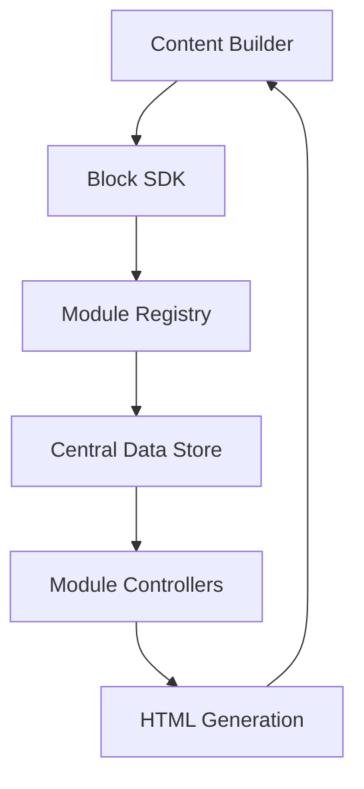

# Milwaukee SFMC Custom Content Blocks 🛠️

<div align="center">

[](https://www.salesforce.com/products/marketing-cloud/overview/)
[](https://www.emailonacid.com/)
[](LICENSE)

A powerful, modular content block system for Salesforce Marketing Cloud, enabling brand-consistent email creation for Milwaukee Tool's marketing communications.

[Getting Started](#getting-started) •
[Features](#features) •
[Documentation](#documentation) •
[Development](#development)

</div>

---

## 🚀 Quick Start

```bash
# Clone the repository
git clone https://github.com/milwaukee/sfmc-content-blocks.git

# Navigate to the project
cd sfmc-content-blocks

# Upload to SFMC Content Builder
# Configure in Content Builder:
# - Entry point: index.html
# - Set block properties
# - Configure permissions
```

## ✨ Features

### Available Modules

| Module Type | Description |
|------------|-------------|
| Lead Story | Hero layout with image and CTA |
| Column Stories | 1-3 column flexible layouts |
| Gallery | 4-image showcase layout |
| Prize Every Month | Promotional template |
| Utility Components | Dividers, spacers, buttons |

## 🏗️ Architecture

### System Overview



## 📖 Documentation

### Core System Components

#### Module Registry

The module registry manages all available content block types:

```javascript
// moduleRegistry.js
const moduleRegistry = {
    modules: {},

    register(moduleName, moduleConfig) {
        // Validate required module methods
        const requiredMethods = [
            'setup', 
            'getPlaceholderData', 
            'updateHtml', 
            'populateForm', 
            'setupEventListeners'
        ];
        
        requiredMethods.forEach(method => {
            if (!moduleConfig[method]) {
                console.warn(`Module ${moduleName} missing: ${method}`);
            }
        });
        
        this.modules[moduleName] = moduleConfig;
    },

    get(moduleName) {
        return this.modules[moduleName];
    }
};
```

#### Central Data Store

Manages application state and data flow:

```javascript
// centralDataStore.js
let state = {
    moduleType: 'leadStory',
    formData: {
        leadStory: {
            titleAlignment: 'left',
            descriptionAlignment: 'left',
            // ... other module-specific data
        }
    },
    fullHtml: ''
};

export function updateFormData(newData) {
    if (newData.moduleType) {
        state.moduleType = newData.moduleType;
    }
    
    Object.keys(newData).forEach(moduleType => {
        if (moduleType !== 'moduleType') {
            state.formData[moduleType] = {
                ...state.formData[moduleType],
                ...newData[moduleType]
            };
        }
    });
}
```

### HTML Generation

Each module implements HTML generation following email-compatible patterns:

```javascript
// Example from leadStory.js
updateHtml(html, formData) {
    const backgroundColor = formData.backgroundColor || '#DB021D';
    const titleAlignment = formData.titleAlignment || 'left';
    
    return `
        <table align="center" border="0" cellpadding="0" 
               cellspacing="0" class="content-outer" 
               role="presentation" 
               style="background-color: ${backgroundColor}; width: 620px;">
            <tr>
                <td class="side" style="width: 20px;">&nbsp;</td>
                <td align="center" class="content-inner" 
                    style="width: 580px;">
                    <!-- Content structure -->
                    ${this.generateContentHTML(formData)}
                </td>
                <td class="side" style="width: 20px;">&nbsp;</td>
            </tr>
        </table>
    `;
}
```

### Rich Text Implementation

The system implements a custom rich text editor:

```javascript
// Rich text event handling example
setupRichTextEditor(elementId, handleChange) {
    const editor = document.getElementById(elementId);
    const toolbar = editor.previousElementSibling;
    
    toolbar.addEventListener('click', (e) => {
        if (e.target.matches('[data-command]')) {
            const command = e.target.getAttribute('data-command');
            
            if (command === 'link') {
                const url = prompt('Enter URL:');
                if (url) {
                    document.execCommand('createLink', false, url);
                    const selection = window.getSelection();
                    const link = selection.anchorNode.parentElement;
                    link.target = '_blank';
                }
            } else {
                document.execCommand(command, false, null);
            }
            
            handleChange(editor.innerHTML);
        }
    });
}
```

### Event Handling System

The system uses a centralized event handling approach:

```javascript
// Example event handler setup
setupEventListeners(handleFormFieldChange) {
    // Form field listeners
    ['imageUrl', 'title', 'description'].forEach(fieldId => {
        const element = document.getElementById(fieldId);
        if (element) {
            element.addEventListener('input', (event) => {
                handleFormFieldChange(
                    'moduleName',
                    fieldId,
                    event.target.value
                );
            });
        }
    });

    // Alignment control listeners
    const alignmentButtons = document.querySelectorAll('.alignment-button');
    alignmentButtons.forEach(button => {
        button.addEventListener('click', () => {
            const alignment = button.dataset.alignment;
            handleFormFieldChange(
                'moduleName',
                'alignment',
                alignment
            );
        });
    });
}
```

### BlockSDK Integration

Example of proper BlockSDK initialization and usage:

```javascript
// main.js
async function init() {
    await waitForSDK();
    const sdk = new window.sfdc.BlockSDK({
        blockEditorWidth: 600,
        tabs: ['htmlblock']
    });

    // Get initial content
    sdk.getContent((content) => {
        if (content) {
            const parser = new DOMParser();
            const doc = parser.parseFromString(content, 'text/html');
            // Parse and populate form
            populateFormFromContent(doc);
        }
    });

    // Set up content updates
    function updateContent(html) {
        sdk.setContent(html);
        sdk.setData({
            moduleType: getCurrentModule(),
            formData: getFormData()
        });
    }
}
```

### Module Template

Template for creating new modules:

```javascript
// newModule.js
import moduleRegistry from './moduleRegistry.js';

const newModule = {
    setup() {
        console.log('New module setup');
    },

    getPlaceholderData() {
        return {
            title: 'Default Title',
            description: 'Default description',
            imageUrl: '',
            alignment: 'left'
        };
    },

    updateHtml(html, formData) {
        return `
            <!-- Your email-compatible HTML -->
            <table>
                <!-- Module structure -->
            </table>
        `;
    },

    populateForm(formData) {
        // Populate form fields with data
        document.getElementById('title').value = formData.title;
        // ... other fields
    },

    setupEventListeners(handleFormFieldChange) {
        // Set up form event handlers
        document.getElementById('title')
            .addEventListener('input', (e) => {
                handleFormFieldChange(
                    'newModule',
                    'title',
                    e.target.value
                );
            });
    }
};

moduleRegistry.register('newModule', newModule);
export default newModule;
```

## 🔄 State Management

### Data Flow Example

```javascript
// Example data flow through the system
const dataFlow = {
    userInput: {
        field: 'title',
        value: 'New Title'
    },
    
    formHandler: (field, value) => {
        // Update module data
        handleFormFieldChange('moduleType', field, value);
    },
    
    centralStore: {
        // State update
        formData: {
            moduleType: {
                title: 'New Title'
            }
        }
    },
    
    htmlGeneration: `
        <table>
            <tr>
                <td>
                    <h1>New Title</h1>
                </td>
            </tr>
        </table>
    `
};
```

## 🧪 Testing

The system is tested across major email clients:

- ✓ Microsoft Outlook (Windows)
- ✓ Apple Mail
- ✓ Gmail (Web/Mobile)
- ✓ iOS Mail
- ✓ Android Mail

## 🔍 Debugging

Debug output is available in the console:

```javascript
// Example debug output:
[2024-01-15T10:30:00] Module: LeadStory
[2024-01-15T10:30:01] Action: FormUpdate
[2024-01-15T10:30:02] HTML Generated: 2.5kb
```

## 📚 Additional Resources

- [SFMC Block SDK Documentation](https://developer.salesforce.com/docs/marketing/marketing-cloud/guide/block-sdk.html)
- [Email Design Guidelines](link-to-guidelines)
- [Milwaukee Tool Brand Standards](link-to-standards)

## 🤝 Contributing

While this is a proprietary project, internal contributions should:

1. Follow the existing module pattern
2. Include console logging
3. Test across email clients
4. Update documentation

## 📄 License

Copyright © 2024 Milwaukee Tool. All rights reserved.

---

<div align="center">
Made with ⚡ by Milwaukee Tool Development Team
</div>
